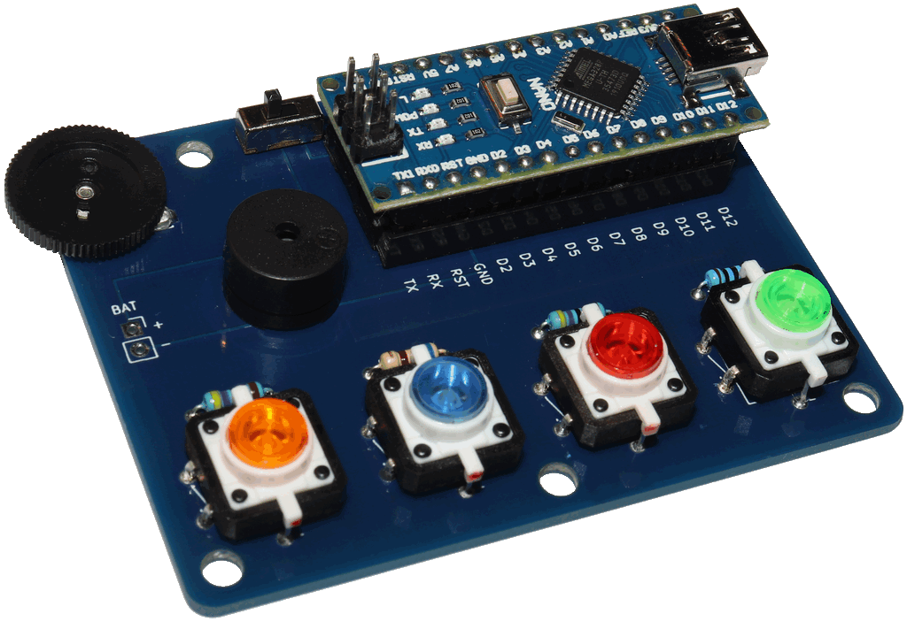

# SequenceGame
An Arduino based sequence memory and repeat game

This game works as follows:
1. The game creates a random sequence of the four colors
2. The game shows the first color (and plays a color specific sound)
3. The player repeats the showed color
4. The game shows the sequence so far and one additional color of the sequence
5. The player repeats the sequence so far
6. Continue with 4.
7. If the player makes a mistake the game is lost (loose sound)
8. If the player got the whole sequence correct the game is won (win sound)

## Alternative programs

Having used this playground board in class, there are many other possibilities to program it:

- A reaction game
- A rythim game / trainer
- A little piano (even using 15 binary tones)
- A jukebox 
- A binary calculator
- A Hot Wire game controller (adding extra hardware)
- A code input for a lock (adding extra hardware)
